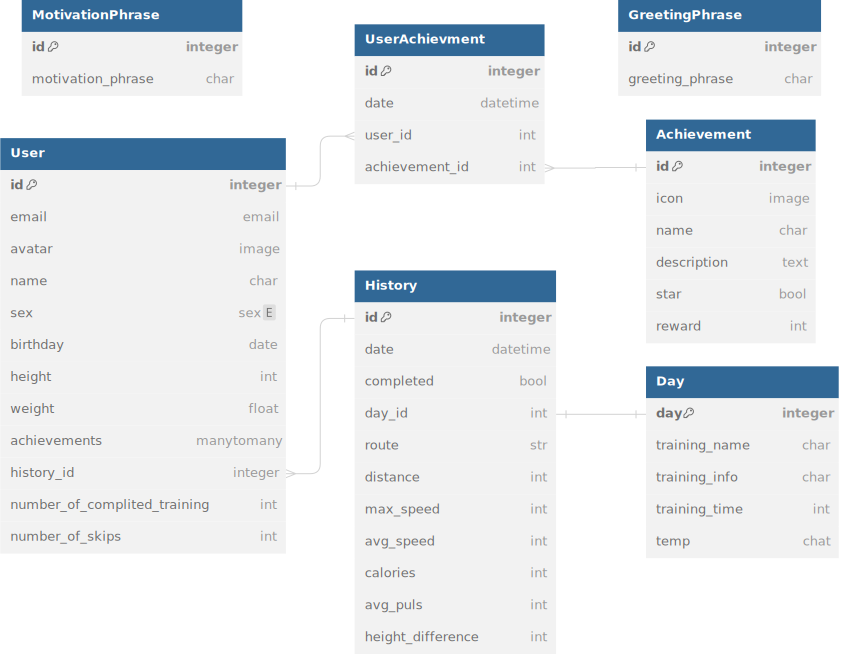

# diary-workout-tracker-backend


### Описание
Научись бегать за 100 дней.

### Технологии

[](https://nginx.org/)
[](https://www.postgresql.org/)
[](https://swagger.io/)
[](https://www.docker.com/)
-----
[](https://www.python.org/)
[](https://www.djangoproject.com/)
[](https://pypi.org/project/djangorestframework/)
---
[](https://pypi.org/project/ruff/)
[](https://pypi.org/project/pytest/)

## Структура базы данных



## Запуск проекта

### Настройка и запуск локально для разработки
Проект использует [Poetry](https://python-poetry.org/) как инструмент управления зависимостями.
1. Клонировать репозиторий.
    ```bash
    git clone git@github.com:Diary-workout-tracker/diary-workout-tracker-backend.git
    cd diary-workout-tracker-backend
    ```
2. Создание и активация виртуального окружения при помощи [poetry](https://python-poetry.org/docs/#installation)

    2.1 Создание отдельного окружения
    ```bash
    python -m venv venv
    source venv/Scripts/activate
    ```
    для Linux и macOS
    ```bash
    python3 -m venv venv
    source venv/bin/activate
    ```

    2.2 Использование poetry
    ```bash
    pip install poetry
    poetry shell
    poetry install
    ```
> **Примечание:** версия python должна быть ^3.11.

3. Инициализация [pre-commit](#технологии).
   ```bash
   poetry run pre-commit install
   ```
4. Создайте и заполните файл `.env` согласно шаблону [.env.example](https://github.com/Diary-workout-tracker/diary-workout-tracker-backend/blob/develop/infra/.env.example)
5. Выполнить команду Make в консоли.
    ```bash
    make project-init-dev # при первом запуске
    ```
    ```bash
    make project-start-dev # при последующих запусках
    ```

## Дополниельные сведения для разработчика


## Полезные материалы
<details>
  <summary><h3>Команды poetry</h3></summary>

- Создание нового проекта: `poetry new new_project`
- Установка зависимостей: `poetry install`
- Запуск виртуального окружения: `poetry shell`
- Внедрение Poetry в уже имеющийся проект: `poetry init`
- Обновление зависимостей: `poetry update`
- Добавление новой библиотеки: `poetry add <имя_библиотеки>`
- Удаление зависимости: `poetry remove <имя_библиотеки>`
- Просмотр зависимостей: `poetry show`
- Запуск из виртуального окружения: `poetry run <команда>`

</details>

<details>
  <summary><h3>Команды pre-commit</h3></summary>

  **Важно** С использованием poetry, выполнение команд из виртуального окружения происходит через `poetry run <команда>`.
- Установить pre-commit в проекте: `pre-commit install`
- Запустить проверку всех хуков: `pre-commit run -a`
- Запустить конкретный хук: `poetry run pre-commit run <имя-хука>`
- Деактивировать автоматическое выполнение хуков перед коммитом: `poetry run pre-commit uninstall`
- Обновить pre-commit хуки: `poetry run pre-commit autoupdate`

</details>

<details>
  <summary><h3>Команды make</h3></summary>

- Удаление Volumes: `make clear-volumes-dev`
- Запуск контейнеров: `make start-containers-dev`
- Выполнить миграции Django: `make migrate-dev`
- Собрать статику Django: `make collectstatic-dev`
- Создать супер пользователя: `make createsuperuser-dev`
- Запуск сервера: `make start-server-dev`
- Инициализировать проект: `make project-init-dev`
- Запустить проект: `make project-start-dev`
- Остановить контейнеры: `make containers-stop-dev`

</details>


## Разработчики

[Струнникова Елизавета](https://github.com/Luna-luns)

[Оганин Петр](https://github.com/necroshizo)

[Шапиро Алексей](https://github.com/holohup)

[Шлемин Сергей](https://github.com/fluid1408)

[Яременко Владислав](https://github.com/VladislavYar)

[Ястребов Владислав](https://github.com/blakkheart)
